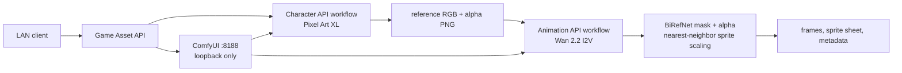

# Pixel Game Asset API Design

## Goal

Build a local or LAN-facing API on top of ComfyUI that accepts a character prompt and a natural-language action prompt, then returns a pixel-art character design plus transparent action frames, a sprite sheet, and reproducibility metadata.

The first release targets a 16 GB NVIDIA GPU and preserves the existing `wan2_2_5b_dual_balanced.json` workflow. The new pipeline reuses its Wan 2.2 TI2V model stack for animation rather than replacing that workflow.

## User Decisions

- Art direction: pixel RPG.
- Actions: arbitrary natural-language action prompt with an optional frame count.
- Final frame format: transparent RGBA PNG.
- Camera: structured `camera` field plus `camera_prompt` for custom views; prompt inference is a fallback.
- Deployment: local or LAN, without authentication in the first release.
- Model downloads: permitted.

## Scope

The deliverable consists of two importable ComfyUI API workflows, a small local HTTP orchestration service, model-installation tooling, and automated tests.

The first release supports 2 through 16 output frames, 64/96/128/256 pixel sprites, one GPU job at a time, and one character action per job. It does not include public internet exposure, authentication, automatic retries, audio, direction-set generation, or game-engine-specific exporters.

## Prerequisites

The service installs these local assets in standard ComfyUI model directories:

- SDXL Base 1.0 (`sd_xl_base_1.0.safetensors`) in `models/checkpoints`.
- Pixel Art XL (`pixel-art-xl.safetensors`) in `models/loras`; it is applied to the SDXL model and CLIP with `LoraLoader` for character design.
- BiRefNet General (`BiRefNet-general-epoch_244.safetensors`) in `models/background_removal` for foreground masks.
- The installed Wan 2.2 TI2V 5B diffusion model, UMT5 text encoder, and Wan VAE for motion generation.

All model downloads are verified by filename, size, and SHA-256 before publication. Download tooling records source URLs and expected hashes in a manifest so models can be audited or replaced without changing the API contract.

## Architecture



`game_asset_api.py` is an `aiohttp` service that listens on `127.0.0.1` by default and can bind to a LAN interface through configuration. It is the sole public API surface. It validates requests, expands prompts, submits exported ComfyUI API prompts to `http://127.0.0.1:8188/prompt`, polls history, builds the sprite sheet, and writes a durable job manifest under `output/game_assets/<job_id>/`.

ComfyUI remains bound to loopback. The service serializes GPU jobs, so the Pixel Art XL and Wan models are never sampled concurrently.

## Workflows

### Character Design

`pixel_character_design_api.json` loads SDXL Base 1.0, applies the Pixel Art XL LoRA, combines the caller's character prompt with fixed pixel-art and camera constraints, samples a 512 square character image, and saves an RGB reference image. The same image passes through `LoadBackgroundRemovalModel`, `RemoveBackground`, and `JoinImageWithAlpha` to produce a transparent character design PNG.

The RGB reference feeds animation because Wan conditions on RGB image tensors. The alpha version is returned to the caller as the character-design asset.

### Action Frames

`pixel_character_action_api.json` loads the RGB reference from the controlled ComfyUI input directory and uses `Wan22ImageToVideoLatent` with that image as `start_image`. The service adds the action and camera constraints to the Wan prompt and requests a source length compatible with Wan:

```text
source_frame_count = 4 * ceil((frame_count - 1) / 4) + 1
```

After decoding, the batch runs through BiRefNet, `JoinImageWithAlpha`, and nearest-neighbor scale-down to the requested sprite size. `SaveImage` writes the transparent source batch to the job's frame directory.

The service selects exactly the requested frame count with evenly spaced source indices:

```text
source_index(i) = round(i * (source_frame_count - 1) / (frame_count - 1))
```

It writes output frames in chronological order and creates a row-major sheet with `ceil(sqrt(frame_count))` columns.

## API Contract

### Submit

`POST /v1/game-assets`

```json
{
  "character_prompt": "red-haired knight in light armor carrying a longsword",
  "action_prompt": "swing the sword to the right, then recover",
  "frame_count": 8,
  "camera": "custom",
  "camera_prompt": "fixed side view, full body, no camera movement",
  "seed": 12345,
  "sprite_size": 128
}
```

`camera` accepts `side`, `front`, `top_down`, `three_quarter`, and `custom`. `custom` requires a non-empty `camera_prompt`; omitted camera values are inferred from the character prompt. `frame_count` defaults to 8. `sprite_size` defaults to 128 and accepts 64, 96, 128, or 256.

The endpoint responds `202 Accepted` with a UUID job id and `queued` status.

### Poll

`GET /v1/jobs/{job_id}` returns one of `queued`, `generating_character`, `generating_action`, `postprocessing`, `completed`, or `failed`. A completed job includes relative asset URLs only:

```json
{
  "job_id": "uuid",
  "status": "completed",
  "character_design": "/assets/uuid/character.png",
  "frames": ["/assets/uuid/frames/000.png"],
  "spritesheet": "/assets/uuid/spritesheet.png",
  "metadata": "/assets/uuid/metadata.json"
}
```

`GET /assets/{job_id}/...` serves only files below that job's output directory after validating the UUID and normalized path.

## Metadata

`metadata.json` records the public request, expanded character and action prompts, seed, chosen camera constraints, intermediate Wan frame count, source-to-output frame map, output dimensions, sprite-sheet columns and rows, output frame order, ComfyUI prompt ids, model filenames, and creation timestamps.

## Error Handling

- Request validation failures return `400` before GPU queueing.
- Missing models or an unhealthy ComfyUI service return `503`.
- ComfyUI execution errors, missing outputs, or timeouts mark the job `failed` with a stage-specific, sanitized error message.
- A completed character reference remains in the job directory after an animation failure, so a later retry can reuse it.
- Asset routing rejects traversal, absolute paths, and files outside the job directory.

## Verification

1. Unit tests cover payload validation, camera resolution, prompt expansion, Wan frame-length conversion, frame selection, safe asset paths, manifest transitions, and RGBA sprite-sheet composition.
2. Workflow validation parses both JSON files, checks all nodes through `/object_info`, and confirms configured models are present in loader options.
3. API integration tests use a local stub of ComfyUI to verify queueing, polling, state transitions, and relative URLs.
4. A live smoke test generates a low-resolution, short action and verifies non-empty character PNG, transparent output frames, sprite sheet, metadata, and a healthy ComfyUI server.
5. A final full run uses the default eight 128-pixel frames and verifies the returned frame count, alpha channel, source-frame mapping, and sheet geometry.
